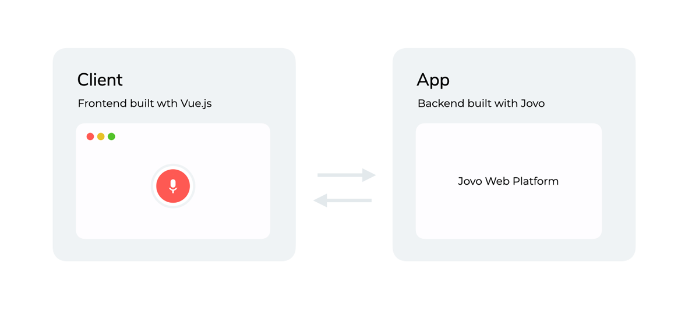

# Jovo Web Starter: Chat Widget

Fully customizable open source chat widget for Jovo chatbots.

This repository contains:
* `app`: Backend logic built with the [Jovo Framework](https://github.com/jovotech/jovo-framework) using its [Web Platform integration](https://github.com/jovotech/jovo-framework/tree/master/jovo-platforms/jovo-platform-web).
* `client`: Frontend built with [Vue.js](https://vuejs.org/) and [Tailwind CSS](https://tailwindcss.com/), communicating with the backend using the [Jovo Web Client for Vue.js](https://github.com/jovotech/jovo-framework/tree/master/jovo-clients/jovo-client-web-vue).

> Note: For demo purposes and the ease of getting started quickly, the template uses the [Web Speech API](https://wicg.github.io/speech-api/) as an ASR, which only works on Google Chrome. To use the Web integration on other browsers, you can integrate one of our integrations of several [cloud ASRs](https://www.jovo.tech/marketplace/tag/asr).

## Getting started

1. Run `npm install`. This will install the dependencies in both `app` and `client`

2. Go into the `client` directory and run `npm run serve` to start the frontend

3. Go into the `app` directory and run `jovo run` to start the backend

4. Open the starter in your browser `localhost:8080`

## Customization

> For a more detailed explanation and walk-through check out our in-depth [tutorial](TODO: link to tutorial)

The starter was built for you to have a working example as well as an entry point to get started with the Jovo Web integration immediately. Because of that, we've tried to keep the starters as small as possible. The following documentation will help you understand how the starter is structured and which components take care of which tasks.

### Client

The client is a Vue.js project that consists of a single component "ChatWidget" which is styled in Tailwind CSS.

#### Component: ChatWidget

The ChatWidget component implements a fully functioning chat body where the user can type in their request and receive a response from the Jovo app. handles the registration for multiple event listeners, namely `ClientEvent.Request`, `ClientEvent.Response`, and `ClientEvent.Action`.

TODO: add links to docs and more info
* `ClientEvent.Request`: triggered before the request is sent out to the Jovo app. In this case, it is used to display the user's input in the chat body.
* `ClientEvent.Response`: triggered when the client receives the Jovo app's response. In this case, it is used to display the app's response in the chat body.
* `ClientEvent.Action`: triggered when the app's response contains an action. In our case, we expect quick replies that are displayed as buttons on top of text input. It also listens for a custom action that opens a link to a new tab.

### App

The Jovo app the new [Jovo Web Platform integration](TODO: link) as well as [NLP.js](https://www.jovo.tech/marketplace/jovo-nlu-nlpjs) as its NLU. It implements a simple interaction where the user can be redirected to the Jovo Framework's documentation.

#### Language Model

The language model consists of two simple intents, `HelloWorldIntent` and `YesIntent`, used to implement the sample interaction.

#### app.ts

The `app.ts` file contains the initialization of the app and its plugins as well as the basic logic for the sample interaction. It makes use of the Web integrations [`Custom Actions`](TODO: link to docs) to send a `redirect` action used to open a link in a new tab.